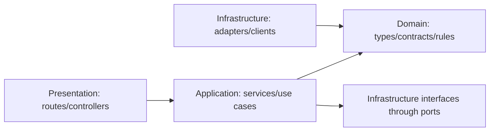

# GrowEasy Backend Foundation Implementation Plan

Status: Draft for approval

Scope: backend foundation only. This plan intentionally does not implement the assignment's main feature work: CSV upload, CSV parsing, AI extraction, CRM field mapping, import confirmation, skipped-record logic, or any import API behavior. Those will be planned and implemented after this foundation is approved.

## 1. Goal

Build an industry-grade TypeScript and Express backend foundation for `final-groweasy.ai/server`, inspired by the existing `scale-to-million` and `API-Monitoring-System/server` backends.

The foundation should make the future CSV importer easy to build without mixing concerns. The first approved implementation should only create the backend skeleton, shared infrastructure, conventions, health endpoints, validation patterns, logging, error handling, testing setup, Docker setup, and module boundaries.

## 2. Reference Backend Analysis

### 2.1 `scale-to-million`

What to borrow:

- TypeScript-first backend with strict compiler settings.
- Clean `app.ts` and `server.ts` split:
  - `app.ts` builds Express and middleware.
  - `server.ts` owns startup and dependency readiness checks.
- Central config files for env, logger, database, Redis, and constants.
- Controller, service, repository separation.
- Route aggregation through `routers/index.ts`.
- Zod validation close to business workflows.
- Central `AppError`, error middleware, and response helpers.
- Health endpoint that checks dependent services.
- Pino and `pino-http` for structured request logs.
- Production Dockerfile with build stage and runtime stage.
- Docker Compose health checks.

What to adapt:

- Keep the strict TypeScript and app/server split.
- Keep Pino as the default logger because it is fast and TypeScript-friendly.
- Do not copy product-specific repositories or read-replica patterns into the foundation.
- Do not require Postgres or Redis on day one because the assignment allows a stateless backend.
- Add stronger lifecycle handling and module boundaries from the monitoring backend.

### 2.2 `API-Monitoring-System/server`

What to borrow:

- Feature/module oriented structure:
  - route
  - controller
  - service
  - repository
  - dependencies/container
- Dependency injection containers per module.
- Shared config, middlewares, utils, constants, and models.
- Central response formatter.
- Request logging with method, path, status, and duration.
- Rate limiting for sensitive/high-load endpoints.
- Startup flow that initializes external dependencies before listening.
- Graceful shutdown for HTTP server and external clients.
- Process-level handling for uncaught exceptions and unhandled rejections.
- Reliability patterns for external services:
  - retry strategy
  - circuit breaker
  - producer abstraction

What to adapt:

- Convert the architecture to strict TypeScript.
- Replace custom validation objects with Zod schemas.
- Prefer Pino over Winston for one consistent logger across the backend.
- Keep RabbitMQ, MongoDB, and Postgres as optional future adapters only. They are not part of the foundation unless a later feature decision requires them.
- Extract the reliability patterns into generic infrastructure utilities so they can later wrap AI calls or queues without being tied to RabbitMQ.

## 3. Recommended Architecture

Use a true 4-layer architecture inside each feature module.

### 3.1 Layer Definitions

1. Presentation Layer
   - Express routes.
   - Controllers.
   - Request parsing and transport-level validation.
   - Response formatting.
   - No business rules.
   - May depend on application layer.

2. Application Layer
   - Use cases and services.
   - Orchestrates workflows.
   - Owns transaction boundaries when persistence is introduced.
   - Depends on domain interfaces/contracts, not concrete infrastructure.
   - Does not import Express types.

3. Domain Layer
   - Pure TypeScript business types, entities, value objects, constants, and domain errors.
   - No Express, database, filesystem, AI SDK, queue, or logger imports.
   - Stable core that future features will build around.

4. Infrastructure Layer
   - Concrete adapters for external systems.
   - Examples for later phases: file parser, AI provider, cache, database, queue, object storage.
   - Implements ports/contracts defined by the domain or application layer.

Dependency rule:



Practical rule: controllers can call services, services can call repositories/adapters through interfaces, domain stays pure, and infrastructure never drives business flow directly.

## 4. Proposed Backend Folder Structure

Target directory: `final-groweasy.ai/server`

```text
server/
  .env.example
  .gitignore
  Dockerfile
  docker-compose.yml
  package.json
  package-lock.json
  README.md
  tsconfig.json
  tsconfig.build.json
  eslint.config.mjs
  prettier.config.cjs
  vitest.config.ts

  src/
    main.ts
    app.ts
    routes.ts
    container.ts

    bootstrap/
      graceful-shutdown.ts
      process-events.ts
      start-server.ts

    config/
      env.ts
      logger.ts
      cors.ts
      rate-limit.ts
      security.ts

    shared/
      domain/
        errors/
          app-error.ts
          validation-error.ts
        types/
          nullable.ts
          result.ts

      application/
        ports/
          clock.port.ts
          id-generator.port.ts
        services/
          clock.service.ts
          id-generator.service.ts

      infrastructure/
        http/
          async-handler.ts
          request-context.ts
        logging/
          logger.types.ts
        resilience/
          circuit-breaker.ts
          retry-policy.ts
        validation/
          zod-error-map.ts

      presentation/
        middlewares/
          error-handler.middleware.ts
          not-found.middleware.ts
          request-id.middleware.ts
          request-logger.middleware.ts
          validate-request.middleware.ts
        responses/
          api-response.ts
          response-sender.ts

    modules/
      health/
        health.container.ts

        domain/
          health-status.ts

        application/
          health.service.ts

        infrastructure/
          health-checker.ts

        presentation/
          health.controller.ts
          health.routes.ts
          health.schemas.ts

      _template/
        README.md

  tests/
    unit/
    integration/
      health.test.ts
    helpers/
      test-app.ts

  scripts/
    check-env.ts
```

### 4.1 Future Feature Module Template

When we later build the actual assignment feature, each feature module should follow this shape:

```text
modules/<feature-name>/
  <feature-name>.container.ts

  domain/
    entities/
    value-objects/
    constants/
    errors/
    ports/

  application/
    dto/
    services/
    use-cases/

  infrastructure/
    adapters/
    repositories/
    clients/

  presentation/
    controllers/
    routes/
    schemas/
```

No feature-specific module should be implemented during the foundation step, except a `_template/README.md` that explains this convention.

## 5. Package Plan

### 5.1 Runtime Dependencies

Recommended foundation dependencies:

```text
compression
cors
dotenv
express
express-rate-limit
helmet
http-status-codes
nanoid
pino
pino-http
zod
```

Why:

- `express`: HTTP server framework required by assignment.
- `zod`: runtime validation plus TypeScript inference.
- `pino` and `pino-http`: structured logs and request logs.
- `helmet`, `cors`, `compression`: standard production HTTP middleware.
- `express-rate-limit`: API abuse protection.
- `dotenv`: local env loading.
- `http-status-codes`: readable status constants.
- `nanoid`: request IDs and generic ID generation.

### 5.2 Development Dependencies

Recommended development dependencies:

```text
@eslint/js
@types/compression
@types/cors
@types/express
@types/node
@types/supertest
eslint
prettier
supertest
tsx
typescript
typescript-eslint
vitest
```

Why:

- `tsx`: fast TypeScript dev server.
- `typescript`: strict build and type checks.
- `vitest`: unit and integration tests.
- `supertest`: HTTP integration tests without opening a real port.
- `eslint` and `prettier`: consistent code quality.

### 5.3 Deferred Feature Dependencies

Do not install these in the foundation unless we explicitly decide to include them later:

```text
multer or busboy
csv-parse or papaparse
openai, @google/generative-ai, or anthropic SDK
p-limit
p-retry
bullmq
ioredis
pg
prisma or drizzle
```

Reason: these belong to the CSV/AI/import feature phase. The foundation should prepare clean adapter boundaries but avoid bringing feature complexity into the first setup.

## 6. Implementation Phases After Approval

### Phase 1: Project Initialization

Create the Node and TypeScript project inside `final-groweasy.ai/server`.

Files:

- `package.json`
- `package-lock.json`
- `tsconfig.json`
- `tsconfig.build.json`
- `.gitignore`
- `.env.example`

Scripts:

```json
{
  "dev": "tsx watch src/main.ts",
  "build": "tsc -p tsconfig.build.json",
  "start": "node dist/main.js",
  "typecheck": "tsc --noEmit",
  "lint": "eslint .",
  "format": "prettier --write .",
  "format:check": "prettier --check .",
  "test": "vitest run",
  "test:watch": "vitest",
  "test:coverage": "vitest run --coverage"
}
```

TypeScript settings:

- `target`: `ES2022`
- `module`: `NodeNext`
- `moduleResolution`: `NodeNext`
- `strict`: `true`
- `noImplicitReturns`: `true`
- `noUnusedLocals`: `true`
- `noUnusedParameters`: `true`
- `sourceMap`: `true`
- `rootDir`: `src`
- `outDir`: `dist`

Module style:

- Use ESM with `"type": "module"`.
- Use `.js` extensions in TypeScript source imports for NodeNext compatibility.

### Phase 2: Environment Configuration

Create `src/config/env.ts` using Zod to validate environment variables at startup.

Initial env contract:

```text
NODE_ENV=development
PORT=5000
API_PREFIX=/api/v1
CORS_ORIGINS=http://localhost:3000
LOG_LEVEL=debug
REQUEST_BODY_LIMIT=1mb
RATE_LIMIT_WINDOW_MS=900000
RATE_LIMIT_MAX_REQUESTS=100
SHUTDOWN_TIMEOUT_MS=10000
```

Rules:

- All env access goes through `env.ts`.
- No direct `process.env` reads outside config.
- Missing or invalid required env should fail fast during startup.
- `.env.example` should be complete and safe to commit.
- Real `.env` should remain ignored.

### Phase 3: Express App Shell

Create `src/app.ts` as a pure app factory.

Responsibilities:

- Create Express app.
- Add request ID middleware.
- Add Pino HTTP request logging.
- Add Helmet.
- Add CORS allowlist.
- Add compression.
- Add JSON/body parser with size limits.
- Add rate limit middleware.
- Mount routes under `env.API_PREFIX`.
- Add root metadata endpoint.
- Add 404 middleware.
- Add centralized error handler.

Rules:

- `app.ts` should not call `listen`.
- `app.ts` should not connect to external services.
- App creation should be testable without opening a network port.

### Phase 4: Server Startup and Lifecycle

Create startup files:

- `src/main.ts`
- `src/bootstrap/start-server.ts`
- `src/bootstrap/graceful-shutdown.ts`
- `src/bootstrap/process-events.ts`

Responsibilities:

- Build the application container.
- Create Express app.
- Start HTTP server.
- Log startup metadata.
- Register `SIGINT` and `SIGTERM` shutdown.
- Close HTTP server gracefully.
- Reserve hooks for future external resources such as Redis, database, queue, or AI clients.
- Handle uncaught exceptions and unhandled promise rejections by logging and shutting down.

Rules:

- Startup should fail if env validation fails.
- Shutdown should have a timeout to avoid hanging forever.
- Future dependencies must implement a common close/dispose shape before being added to lifecycle.

### Phase 5: Shared Response and Error System

Create response helpers inspired by both references.

Response shape:

```json
{
  "success": true,
  "message": "Success",
  "data": {},
  "meta": {
    "requestId": "..."
  },
  "timestamp": "2026-07-07T00:00:00.000Z"
}
```

Error shape:

```json
{
  "success": false,
  "message": "Validation failed",
  "error": {
    "code": "VALIDATION_ERROR",
    "details": []
  },
  "meta": {
    "requestId": "..."
  },
  "timestamp": "2026-07-07T00:00:00.000Z"
}
```

Files:

- `shared/domain/errors/app-error.ts`
- `shared/domain/errors/validation-error.ts`
- `shared/presentation/responses/api-response.ts`
- `shared/presentation/responses/response-sender.ts`
- `shared/presentation/middlewares/error-handler.middleware.ts`
- `shared/presentation/middlewares/not-found.middleware.ts`
- `shared/infrastructure/http/async-handler.ts`

Rules:

- Controllers should not manually repeat JSON envelope structure.
- Unknown errors should be logged and returned as generic 500 responses.
- Operational errors should keep their expected status code and public message.
- Zod errors should be normalized into a consistent validation response.

### Phase 6: Request Context and Logging

Create request-context support.

Files:

- `shared/presentation/middlewares/request-id.middleware.ts`
- `shared/presentation/middlewares/request-logger.middleware.ts`
- `shared/infrastructure/http/request-context.ts`
- `config/logger.ts`

Responsibilities:

- Generate or accept `x-request-id`.
- Attach request ID to response headers.
- Include request ID in logs.
- Log method, URL, status code, response time, IP, and user agent.
- Avoid logging request bodies by default.

Logger decision:

- Use Pino for application logs.
- Use `pino-http` for HTTP logs.
- Configure log level through env.
- Pretty logs can be added for local development later, but JSON logs are preferred for production.

### Phase 7: Security Foundation

Create:

- `src/config/security.ts`
- `src/config/cors.ts`
- `src/config/rate-limit.ts`

Foundation rules:

- Helmet enabled globally.
- CORS restricted by `CORS_ORIGINS`.
- JSON request body limit configured by env.
- Rate limiting enabled globally or under `/api/v1`.
- Hide Express implementation details.
- Validate all request input through schemas once feature endpoints exist.

Deferred until feature phase:

- Upload file size limits.
- CSV MIME/type checks.
- AI provider key validation.
- Per-endpoint rate limits for import endpoints.

### Phase 8: Health Module

Implement only foundational health endpoints.

Routes:

```text
GET /health
GET /api/v1/health
GET /api/v1/health/live
GET /api/v1/health/ready
```

Expected behavior:

- `live`: confirms process is running.
- `ready`: confirms app is ready to accept traffic.
- base health: returns service name, environment, uptime, timestamp, and version if available.

Layering:

```text
modules/health/presentation/health.routes.ts
modules/health/presentation/health.controller.ts
modules/health/application/health.service.ts
modules/health/domain/health-status.ts
modules/health/infrastructure/health-checker.ts
modules/health/health.container.ts
```

Rules:

- No database or cache checks until those dependencies are actually added.
- Health module proves the layered pattern without implementing assignment features.

### Phase 9: Dependency Injection Composition

Create `src/container.ts`.

Responsibilities:

- Build shared services.
- Build module containers.
- Return route modules to `routes.ts`.
- Own object wiring so controllers/services are easy to test.

Pattern:

```text
container.ts
  -> create logger/config/shared utilities
  -> create health module container
  -> expose modules to route composition
```

Rules:

- Avoid importing concrete infrastructure directly inside controllers.
- Avoid constructing services inside route handlers.
- Prefer constructor injection, following the monitoring backend's dependency style.

### Phase 10: Validation Foundation

Create reusable Zod middleware:

- `shared/presentation/middlewares/validate-request.middleware.ts`
- `shared/infrastructure/validation/zod-error-map.ts`

Supported validation targets:

- `body`
- `query`
- `params`
- `headers`

Rules:

- Schemas live beside the route/controller in the presentation layer.
- Services receive already-validated DTOs.
- Domain invariants remain in the domain layer when needed.
- No assignment-specific schemas in foundation.

### Phase 11: Resilience Utilities

Create generic infrastructure utilities inspired by the monitoring backend:

- `shared/infrastructure/resilience/retry-policy.ts`
- `shared/infrastructure/resilience/circuit-breaker.ts`

Foundation scope:

- Implement generic utilities or define interfaces only.
- Add focused unit tests.
- Do not connect them to AI, queues, CSV parsing, or import workflows yet.

Reason:

- Future AI calls will benefit from retry and circuit breaker patterns.
- Keeping them generic prevents feature coupling.

### Phase 12: Testing Foundation

Create:

- `vitest.config.ts`
- `tests/helpers/test-app.ts`
- `tests/integration/health.test.ts`
- Unit tests for:
  - env parsing
  - response formatter
  - error handler
  - retry policy
  - circuit breaker

Testing rules:

- App tests should use Supertest and app factory.
- Tests should not require a real port.
- No real external services in foundation tests.
- Use dependency injection for test doubles.

Minimum acceptance commands:

```text
npm run typecheck
npm run lint
npm run test
npm run build
```

### Phase 13: Docker and Local Runtime

Create:

- `Dockerfile`
- `docker-compose.yml`
- `.dockerignore`

Dockerfile:

- Multi-stage build like `scale-to-million`.
- Use Node Alpine image.
- Run `npm ci`.
- Build TypeScript.
- Prune dev dependencies for runtime.
- Start with `node dist/main.js`.

Docker Compose foundation:

- Server container only at first.
- Health check against `/health`.
- Env loaded from `.env` or compose defaults.
- No Postgres, MongoDB, Redis, or RabbitMQ until approved by a feature need.

Reason:

- The assignment says database is optional.
- Stateless foundation keeps setup simple and deployable.
- We can add Redis/queue later if we implement progress, background jobs, or retryable async imports.

### Phase 14: README Foundation

Create `server/README.md`.

Sections:

- Backend overview.
- Architecture layers.
- Local setup.
- Environment variables.
- Scripts.
- Health endpoints.
- Testing commands.
- Docker usage.
- Current scope and deferred feature work.

The README should clearly state that CSV import and AI extraction are intentionally not implemented in the foundation phase.

## 7. API Foundation Contract

Only foundational endpoints should exist after setup:

```text
GET /
GET /health
GET /api/v1/health
GET /api/v1/health/live
GET /api/v1/health/ready
```

No CSV or AI endpoints in this phase.

## 8. Quality Gates

The foundation implementation is complete only when:

- TypeScript strict mode passes.
- Build succeeds.
- Lint succeeds.
- Tests pass.
- Server starts locally.
- Health endpoints respond correctly.
- Docker image builds.
- Docker Compose server starts and health check passes.
- README explains setup clearly.
- No assignment feature logic has been added.

## 9. Design Decisions To Approve

Recommended defaults:

1. Use Express 5 with TypeScript.
2. Use ESM and NodeNext module resolution.
3. Use Pino for logging.
4. Use Zod for env and request validation.
5. Keep the backend stateless in the foundation.
6. Add Docker only for the server at first.
7. Create a health module to demonstrate the 4-layer architecture.
8. Create generic retry and circuit-breaker utilities now, but do not wire them to feature code yet.

Open decisions:

1. Package manager: use `npm` to match the existing repositories, unless you want `pnpm`.
2. Test runner: use `vitest`, unless you prefer Jest.
3. Module naming: use `modules/` for feature modules, matching the monitoring backend style, or `features/` if you prefer product language.
4. Docker Compose services: server-only now, or include Redis early for future progress tracking.

My recommendation:

- Use `npm`, `vitest`, `modules/`, and server-only Docker Compose for the foundation.

## 10. Deferred Assignment Feature Work

These are intentionally outside this foundation plan:

- CSV upload route.
- Drag/drop frontend integration.
- CSV parser adapter.
- Preview processing.
- Confirm import endpoint.
- AI provider selection.
- AI prompt engineering.
- Batch processing.
- CRM record schema.
- Skipped record handling.
- Import result response shape.
- Progress events or streaming.
- Persistence of import jobs.

After this foundation is approved, the next backend plan can focus specifically on the CSV/AI import module using the same 4-layer architecture.

